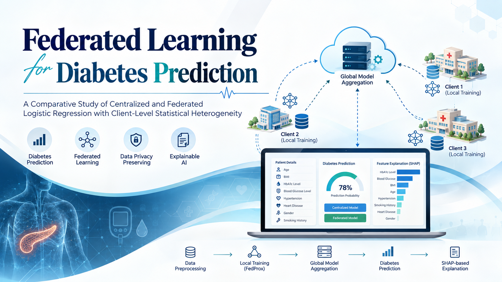

<p align="center">
  
</p>

<p align="center">
  <strong>Privacy-Preserving Diabetes Prediction with Federated Learning</strong>
</p>

<p align="center">
  <a href="#overview">Overview</a> •
  <a href="#features">Features</a> •
  <a href="#architecture">Architecture</a> •
  <a href="#methodology">Methodology</a> •
  <a href="#results">Results</a> •
  <a href="#tech-stack">Tech Stack</a> •
  <a href="#getting-started">Getting Started</a> •
  <a href="#project-structure">Project Structure</a> •
  <a href="#license">License</a>
</p>

<p align="center">
  
  
  
  
  
  
</p>

---

## 📋 Overview

This project builds a **diabetes prediction system** with Logistic Regression and compares **centralized** and **federated** learning. Its main focus is how **client-level statistical heterogeneity** affects federated performance, evaluated under **IID** and **non-IID** data distributions with **3, 5, and 10 clients**.

Class imbalance is handled with **SMOTENC**, and federated training uses **FedProx** with **sample-size-weighted server aggregation**.

The project delivers three interconnected components:

- **🧪 Centralized Baseline**: Logistic Regression trained on the full dataset with a validated decision threshold.
- **🌐 Federated Pipeline**: FedProx training across simulated clients without sharing raw training data.
- **🩺 Streamlit Demo App**: Upload a medical report, extract patient attributes, and get predictions with SHAP explanations.

---

## ✨ Features

### Centralized Learning
- Logistic Regression on the complete training set
- **3-fold out-of-fold** validation to select a common threshold by maximizing F1-score
- Selected threshold: **`0.8752`** (standard `0.50` also evaluated as reference)

### Federated Learning
- **FedProx** local optimization (μ = 0.05) to stabilize training on heterogeneous clients
- **Local SMOTENC**: synthetic samples are generated per client and never leave it
- **Sample-size-weighted** server aggregation
- IID (stratified) and non-IID (class-wise Dirichlet, α = 0.30) partitioning

### Experiments
- Centralized vs. federated comparison
- IID vs. non-IID comparison
- Client-count study: **3, 5, 10**
- Classification threshold analysis (precision-recall trade-off)

### Streamlit Application
- Medical report upload and patient attribute extraction
- Centralized and federated model predictions
- Prediction probability display
- SHAP-based feature explanations

---

## 🏗️ Architecture

```
┌─────────────────────────────────────────────────────────┐
│                      CLIENTS (1..N)                      │
│  Local Data ─── Local SMOTENC ─── FedProx Local Training │
├─────────────────────────────────────────────────────────┤
│                  model weights only ↑↓                   │
├─────────────────────────────────────────────────────────┤
│                        SERVER                            │
│  Sample-Size-Weighted Aggregation ─── Global Model       │
│  (40 communication rounds)                               │
└─────────────────────────────────────────────────────────┘
```

| Layer | Responsibility |
|-------|---------------|
| **Clients** | Hold local data, apply SMOTENC locally, run 3 local FedProx epochs per round |
| **Server** | Aggregates client updates weighted by sample size, broadcasts the global model |
| **Evaluation** | Scores the global model on the held-out test set using a shared threshold |

---

## 🔬 Methodology

### Dataset

Source: [Diabetes Prediction Dataset (Kaggle)](https://www.kaggle.com/)

| Property | Value |
|----------|-------|
| Original records | 100,000 |
| Cleaned records | 96,146 |
| Train / test split | 80 / 20 (stratified) |
| Training records | 76,916 |
| Test records | 19,230 |
| Features | age, BMI, HbA1c level, blood glucose level, hypertension, heart disease, gender, smoking history |

### Preprocessing

1. Duplicate removal
2. Categorical value cleaning
3. Data validation and sanity checks
4. `StandardScaler` for numerical features
5. Encoding of categorical and binary features
6. `SMOTENC` for class imbalance (**training data only**)

### Federated Hyperparameters

| Parameter | Value |
|-----------|-------|
| Communication rounds | 40 |
| Local epochs | 3 |
| Batch size | 128 |
| Learning rate | 0.10 |
| L2 regularization | 1 × 10⁻⁴ |
| FedProx coefficient (μ) | 0.05 |
| Non-IID Dirichlet α | 0.30 |

---

## 📊 Results

### Centralized vs. 3-Client Federated

| Model | Accuracy | Precision | Recall | F1-Score | ROC-AUC | PR-AUC |
|-------|----------|-----------|--------|----------|---------|--------|
| Centralized | 95.51% | 78.70% | 67.33% | 72.58% | 0.9600 | 0.8170 |
| Federated IID | 95.49% | 78.55% | 67.16% | 72.41% | 0.9599 | 0.8168 |
| Federated Non-IID | 95.65% | 80.31% | 67.10% | 73.11% | 0.9589 | 0.8150 |

### Client-Count Experiment

| Distribution | Clients | Accuracy | Precision | Recall | F1-Score |
|--------------|---------|----------|-----------|--------|----------|
| IID | 3 | 95.49% | 78.55% | 67.16% | 72.41% |
| IID | 5 | 95.50% | 78.70% | 67.10% | 72.44% |
| IID | 10 | 95.51% | 78.65% | 67.33% | 72.55% |
| Non-IID | 3 | 95.65% | 80.31% | 67.10% | 73.11% |
| Non-IID | 5 | 95.14% | 74.74% | 67.87% | 71.14% |
| Non-IID | 10 | 95.35% | 97.51% | 48.53% | 64.80% |

### 🔑 Key Findings

- Federated Logistic Regression matches the centralized baseline in the three-client experiments.
- **IID** performance stays stable from 3 to 10 clients.
- **Non-IID** runs show greater variation in precision and recall (10 clients: 97.51% precision, 48.53% recall).
- Client-level class distributions can differ substantially under non-IID partitioning.
- The classification threshold strongly affects the precision-recall trade-off.
- Raw training data never leaves the client.

> ⚠️ **Caveat:** Changes seen when increasing client count cannot be attributed to client count alone, because the generated partitions, compositions, and sample sizes also change.

---

## 🛠️ Tech Stack

| Category | Technology |
|----------|-----------|
| **Language** | Python |
| **Data Processing** | Pandas, NumPy |
| **Modeling** | Scikit-learn (Logistic Regression), FedProx |
| **Imbalance Handling** | imbalanced-learn (SMOTENC) |
| **Explainability** | SHAP |
| **App** | Streamlit |
| **Visualization** | Matplotlib |
| **Environment** | Jupyter Notebook |

---

## 🚀 Getting Started

### Prerequisites

- **Python 3.9+**
- **pip** or **conda**
- Kaggle [Diabetes Prediction Dataset](https://www.kaggle.com/) CSV

### Setup

1. **Clone the repository**
   ```bash
   git clone https://github.com/Prathyush-RK/<your-repo>.git
   cd <your-repo>
   ```

2. **Install dependencies**
   ```bash
   pip install pandas numpy scikit-learn imbalanced-learn shap streamlit matplotlib jupyter
   ```

3. **Add the dataset**

   Download the CSV from Kaggle and place it in the `data/` directory.

4. **Run the notebooks / app**
   ```bash
   jupyter notebook
   streamlit run app.py
   ```

---

## 📂 Project Structure

> Adjust to match your repository.

```
├── banner.png
├── data/                        # Dataset (not committed)
├── notebooks/
│   ├── centralized.ipynb        # Centralized baseline
│   └── federated.ipynb          # FedProx experiments (IID / non-IID)
├── app.py                       # Streamlit demo
├── requirements.txt
└── README.md
```

---

## ⚠️ Limitations

- Clients are **simulated** by partitioning a single dataset, not real healthcare institutions.
- Results need validation on **real multi-institutional healthcare data**.

---

## 🔮 Future Work

- [ ] Differential privacy
- [ ] Multi-task federated learning for multi-disease diagnosis
- [ ] Federated optimization for heterogeneous clients
- [ ] Comprehensive evaluation dashboard

---

## 🤝 Contributing

Contributions are welcome! Please follow these steps:

1. Fork the repository
2. Create a feature branch (`git checkout -b feature/amazing-feature`)
3. Commit your changes (`git commit -m 'Add amazing feature'`)
4. Push to the branch (`git push origin feature/amazing-feature`)
5. Open a Pull Request

---

## 📄 License

This project is licensed under the MIT License. See the [LICENSE](LICENSE) file for details.

---
